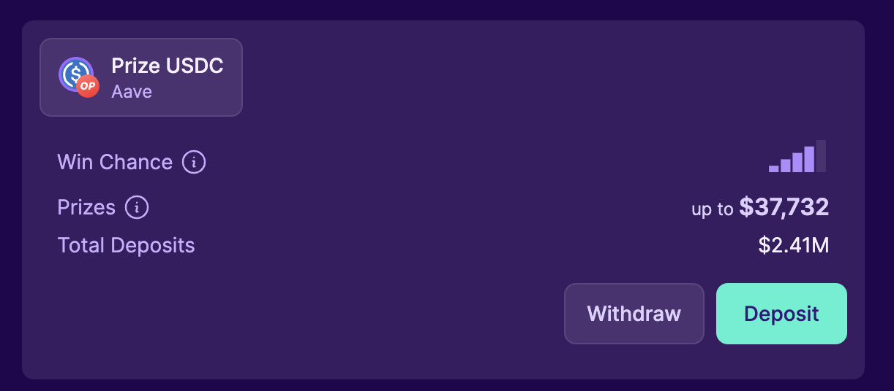
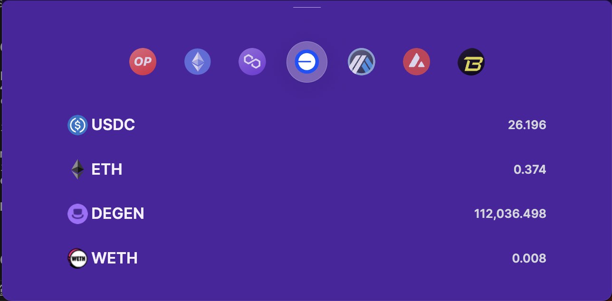

  
X
  

 

# 💻 &nbsp; PoolTogether Client Monorepo x Pay With Glide

This fork of the pool together monorepo integrates with [paywithglide](https://paywithglide.xyz/) to enable cross chain payments into the pool protocol.

In the [main app](cabana.fi), you're able to deposit with the vault native token as well as zap from other tokens. However you can only zap from tokens on the same chain as the vault.

With this upgrade, you can now also zap from other chains into the vault.

## How To Test

- Go to [https://cabana-glide.vercel.app/vaults?network=10](https://cabana-glide.vercel.app/vaults?network=10)

**Update:** 
- It now supports many more pools including przUSDC Base, przUSDC Arbitrum, przWeth OP, przWETH Arb, przPOOL 0P, przLUSD, przDAI OP. 
- It also no support more cross chain paying options (previously only Base, Op and Arb) including Ethereum(mainnet), Avalanche, Polygon and Blast

- Connect Your Wallet

- Click `Deposit` button on the optimism prize USDC vault

- Pick and choose which of the tokens you want to swap with. By default, it only shows tokens you have your wallet. If it shows none, get some tokens first.

N/B To run this repo locally, follow the [Main Repo Guide](https://github.com/GenerationSoftware/pooltogether-client-monorepo/blob/main/README.md)

